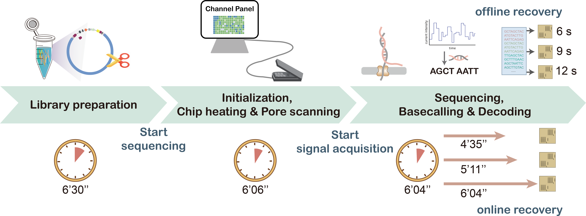

## Approaching single-molecule data readout for DNA Storage



## Table of Contents

- [Approaching single-molecule data readout for DNA Storage](#approaching-single-molecule-data-readout-for-dna-storage)
- [Table of Contents](#table-of-contents)
- [Overview](#overview)
- [Requirements](#requirements)
- [Files](#files)
- [Compilation](#compilation)
- [Example of usage](#example-of-usage)
  - [1. Get PN sequence and reads](#1-get-pn-sequence-and-reads)
  - [2. PN sequence alignment \& indel correction](#2-pn-sequence-alignment--indel-correction)
  - [3. LDPC decoding](#3-ldpc-decoding)
  - [4.  Recovery of original file](#4--recovery-of-original-file)
- [License](#license)

## Overview

Synthetic DNA is a promising medium for long-term data storage. Nanopore sequencing can facilitate rapid readout of large DNA fragments, though suffering from the severe and notorious insertion/deletion errors. We present a highly reliable storage scheme with medium-length encoded DNA fragments (a few to tens of kilobases) and fast recovery schemes using low coverage nanopore sequencing. Using the readout-aware pseudo-noise sequences, the nanopore reads with arbitrary start points are directly located and the base insertions/deletions are identified, enabling fast and reliable recovery even at very low coverages.

Here we provide the code for rapid readout and reliable data recovery in nearly single-molecule scenarios, showcasing the potential of using medium-length DNA sequences for data storage. The program is developed in C and operates in four main steps:

1. **Get PN Sequence and Reads**: Extract corrupted PN sequences from nanopore sequencing reads.
2. **PN Sequence Alignment & Indel Correction**: Align the corrupted PN sequence to ideal PN sequence and perform insertion-deletion (indel) correction.
3. **LDPC Decoding**: Apply Low-Density Parity-Check (LDPC) decoding.
4. **Recovery of Original File**: Reconstruct the original data from the decoded bitstream.

In our work, to demonstrate the feasibility of the proposed method, we constructed four plasmids with lengths ranging from 33 to 43 kb and 28 plasmids with lengths ranging from 6 to 8 kb. We provide the raw data (poems in TXT format), the encoded DNA sequences, and sequencing reads obtained through efficient library preparation and nanopore sequencing.

## Requirements

The following tools and dependencies are required:

- **C Compiler**: Ensure `gcc` is installed.
- **Minimap2**: The Minimap2 binary should be available and executable for sequence alignment.

## Files

| Storage location   | **Files**                     | **Description**                                                                                   |
| ------------------ | ----------------------------------- | ------------------------------------------------------------------------------------------------------- |
| **`data`** | **example.fastq**             | Contains sample data with 5,631 sequencing reads. The file is in .zip format and needs to be extracted. |
| **`data`** | **poems.txt**                 | Original data with 7 Chinese poems (945 bytes).                                                         |
| **`data`** | **original_codeword.txt**     | Codeword sequence of 22,680 bits encoded from `poems.txt` using LDPC (22680, 7560) code.              |
| **`data`** | **pseudo_noise_sequence.txt** | Pseudo-noise (PN) sequence used to to locate reads and correct indels.                                 |
| **`data`** | **plasmid_sequence.txt**      | DNA sequence of a plasmid with a total length of 33,558 base pairs.                                     |
| **`data`** | **data_position.txt**         | Specifies the start and end positions of the encoded DNA sequence within the plasmid DNA sequence.      |
| **`src`**  | **get_pn_seq.c**              | Maps a pseudo-noise (PN) sequence to a base sequence using the rule `{0 → A, 1 → T}`.               |
| **`src`**  | **filter_by_length.c**        | Filters and retrieves high-quality plasmid sequencing reads.                                            |
| **`src`**  | **get_reads.c**               | Maps corrupted PN sequence to base sequence using the rule `{0 → A, 1 → T}`.                        |
| **`src`**  | **indel_correction.c**        | Identifies and corrects indel errors in raw reads.                                                      |
| **`src`**  | **R13Decoder**                | Implements (22680, 7560) R=1/3 LDPC decoding.                                                           |
| **`src`**  | **parse_decoding_result.c**   | Parses and processes decoding results.                                                                  |
| **`src`**  | **recovery_poem.c**           | Recovers the original text file from the decoding result.                                               |
| **`src`**  | **merge_codeword.c**          | Bit-wise majority voting.                                                                               |

## Compilation

To compile the individual modules:

```bash
gcc -o filter_by_length filter_by_length.c
gcc -o get_pn_seq get_pn_seq.c
gcc -o get_reads get_reads.c
gcc -o indel_correction indel_correction.c -lm
gcc -o MergeCodeword merge_codeword.c
gcc -o parse_decoding_result parse_decoding_result.c -lm
gcc -o recovery_poem recovery_poem.c
```

## Example of usage

### 1. Get PN sequence and reads

```bash
./run_get_pn_seq_and_reads.sh
```

**Input files:**

- **Plasmid_sequence.txt**: DNA sequence of a plasmid with a total length of 33,558 base pairs (bp).
- **Example.fastq**: Nanopore reads obtained from efficient library preparation.

**Output files:**

- **PN_sequence.fa**: Pseudo-noise (PN) sequence mapped to a base sequence using the rule `{0 → A, 1 → T}`.
- **PN_sequence.mmi**: Minimap2 generated index for the PN sequence.
- **High_quality.fastq**: Retrieved high-quality plasmid nanopore reads.
- **Corrupted_PN_sequence.fastq**: Corrupted PN sequences derived from the nanopore reads.

---

### 2. PN sequence alignment & indel correction

```bash
./run_alignment_and_correction.sh
```

**Input files:**

- **PN_sequence.mmi**: Minimap2 index file for the original PN sequence, generated in the step 1.
- **Corrupted_PN_sequence.fastq**: Corrupted PN sequence, generated in the step 1.
- **PN_sequence.fa**: Original PN sequence, generated in the step 1.

**Output files:**

- **Minimap_align.sam**: Alignment of the PN sequence to the corrupted sequences.
- **polished_codeword.txt**: The corrected codeword after alignment and indel correction.
- **bit_error_befor_decoding.txt**: This file contains four columns: error count, erasure count, error rate, and erasure rate, representing bit error characteristics after indel correction.

---

### 3. LDPC decoding

```bash
./run_decoding.sh
```

**Input files:**

- **polished_codeword.txt**: Codeword file generated from the step 2.
- **Original_codeword.txt**: The original encoded codeword for error rate analysis.

**Output files:**

- **Information.txt**: Decoded information from the codeword.
- **Check.txt**: This file is used to verify the accuracy of decoding results.

---

### 4.  Recovery of original file

```bash
./run_recovery.sh
```

**Input files:**

- **Check.txt**: Used to validate decoding results generated in the step 3.

**Output files:**

- **Poetry_of_recovery.txt**: Digital file recovered from the decoding result. In this example, the stored digital file contains 7 Chinese poems.

---

## License

This project is distributed under the MIT License, which allows for both commercial and private use, modification, and distribution. See the LICENSE file in the repository for more detailed information.
